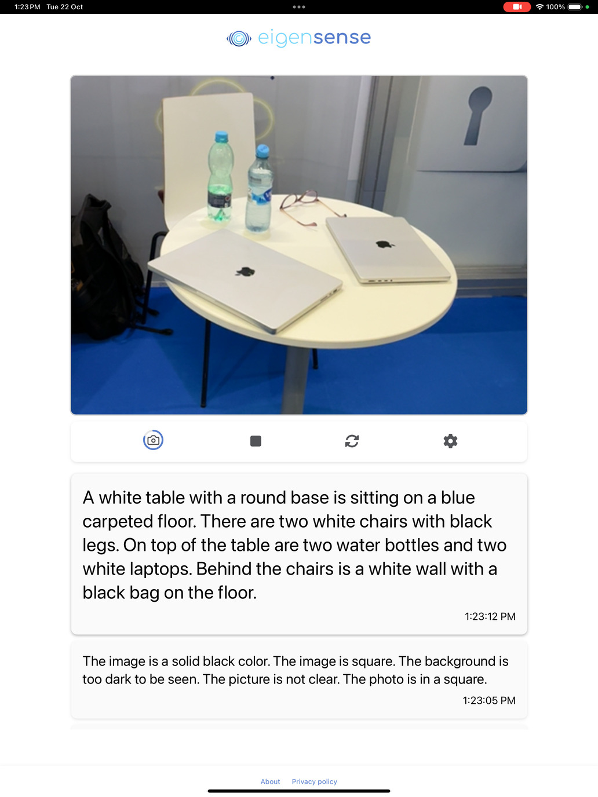

# eigensense
Privacy preserving surveillance

Eigensense is a privacy-preserving surveillance system. The camera uses AI to generate a text description of what it sees. This text is sent to an AI agent which evaluates the situation, and alerts humans if attention is needed. Video is processed completely on-device, not stored, not transmitted outside the camera.

e.g. The camera monitors a patient’s room, periodically sending texts like “There is a person lying on a bed”, which are evaluated by the AI agent. If the camera sends a message like “There is a person lying on the floor”, the AI agent alerts hospital staff.

**NOTE: This is an experimental proof-of-concept, not a production-ready system.**

## How
There are many possible implementations of this system - we describe one of the simplest models in a corporate setting:

1. The sensor is an Apple device, iPad running iOS 18. The sensor software is a web application. Image processing and conversion to text is done by Florence-2 base, a 230 million parameter vision model released by Microsoft. This model converts images to text descriptions purely locally, on-device, without sending any video or image data outside. Other devices: The web app also runs on most modern Macbooks, in Chrome, and on Google Pixel phones.
2. The sensor posts the text description to a corporate Slack channel. An AI bot running within the corporate network is listening to the channel. It has been configured with a natural language prompt, specifying its role and what constitutes an alarming situation. For example, “You are an expert safety inspector. Below is a description of a factory floor. All people should be wearing yellow hard hats for safety. If the description mentions any people without hard hats, say ALARM and explain why, otherwise say OK. Your output will be relayed to safety personnel.”
3. On receipt of a new message, it uses an LLM to evaluate whether the situation requires humans to be alerted. If an alert is warranted, a warning is posted to a separate channel, which results in humans being notified of the situation on their mobiles. This LLM can be run locally so that no surveillance text leaves the corporate network.
4. Humans can join both channels and can observe both the descriptions being posted, and the evaluation being performed by the AI bot.

The web app mode of deployment is a low-friction, low-risk way to try the sensor. No app install, no sign-in, and “uninstall” is as easy as closing a browser tab.

The privacy properties of the system can be verified by examining the web application, and running  it in airplane mode to ensure that images are described using a local model.

## Try it out!

Check out the sensor app by visiting https://eigensense.xyz

On Chrome/macOS and Pixel phones the web app runs without any special setup
To set up an iPad as a sensor:
* Your iOS device must be upgraded to at least 18.0.1
* Go to Settings, Apps, Safari, Advanced, Feature Flags
* Scroll down to “WebGPU” and turn it on.
* Visit https://eigensense.xyz (You may need to restart Safari and/or your device)

Once the models are loaded, you will start getting descriptions of the camera feed. Switch to airplane mode and it continues to generate descriptions.

